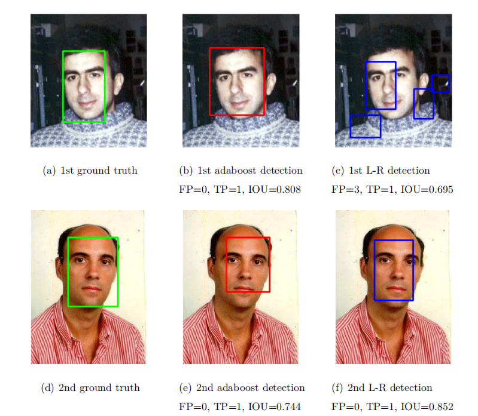

# Face Recognition System Experiment Project
## Project Overview
This project aims to explore and implement face detection technology based on Haar features and the Adaboost algorithm, as well as the application of the Logistic Regression model in face classification tasks. The experiment utilizes the [Caltech 10kWeb Faces](https://www.vision.caltech.edu/datasets/caltech_10k_webfaces/) dataset and preprocesses the data to suit the needs of the detection task. Through comparative analysis, the experiment evaluates the performance of the two algorithms in different aspects.

## Experimental Environment
- **Programming Language**: Python
- **Frameworks and Libraries**: PyTorch, NumPy, Matplotlib, Scikit-learn

## Installation Guide
1. Ensure Python 3.x is installed.
2. Install the required libraries:
   ```
   pip install torch numpy matplotlib scikit-learn
   ```

## Detailed Experimental Principles
### Adaboost Algorithm
- **Weak Classifiers**: Multiple weak classifiers (such as MLP) are combined through weighted voting to form a strong classifier.
- **Weight Update**: Sample weights and classifier weights are updated based on the classifier's error on the samples.

### Logistic Regression
- **Probability Prediction**: Predicts the probability of a given input belonging to a certain class.
- **Loss Function**: Binary cross-entropy loss function is used for optimization.

## Experimental Steps
1. **Dataset Preprocessing**: Generate bounding boxes and construct positive and negative sample datasets.
2. **Haar Feature Extraction**: Select and extract 15 types of Haar features.
3. **MLP Weak Classifier Construction**: Construct and train 3 MLP classifiers as weak classifiers in the Adaboost algorithm.
4. **Adaboost Classifier Training**: Train and test the Adaboost classifier.
5. **Logistic Regression Binary Classification**: Use the Logistic Regression model for the classification task.
6. **Sliding Window and NMS**: Apply the classifier to the image, and obtain the face bounding boxes through the sliding window and NMS.

## Experimental Results Analysis
- **Adaboost**: Shows better generalization on the test set but requires a longer training time.
- **Logistic Regression**: Faster inference speed, suitable for resource-constrained environments, but slightly inferior performance on the test set compared to Adaboost.


## Experimental Conclusion
- Adaboost is suitable for tasks that require higher stability and generalization capabilities.
- Logistic Regression is suitable for tasks with less stringent requirements for accuracy and stability but limited computational power.



## Project Source Code
The source code has been uploaded to GitHub and can be accessed through the following link:
[Haar_Adaboost GitHub Repository](https://github.com/CaiShee/Haar_Adaboost.git)

## Contributors
- **CaiShee** - Experiment design, execution, and report writing

## Acknowledgements
- Caltech 10kWeb Faces Dataset Team - Provided the data required for the experiment.

## Contact Information
- **Email**: [csy_xjtu@outlook.com](csy_xjtu@outlook.com)
- **GitHub**: [https://github.com/CaiShee](https://github.com/CaiShee)

## License
This project is licensed under the MIT License, see the [LICENSE](LICENSE) file for details.

